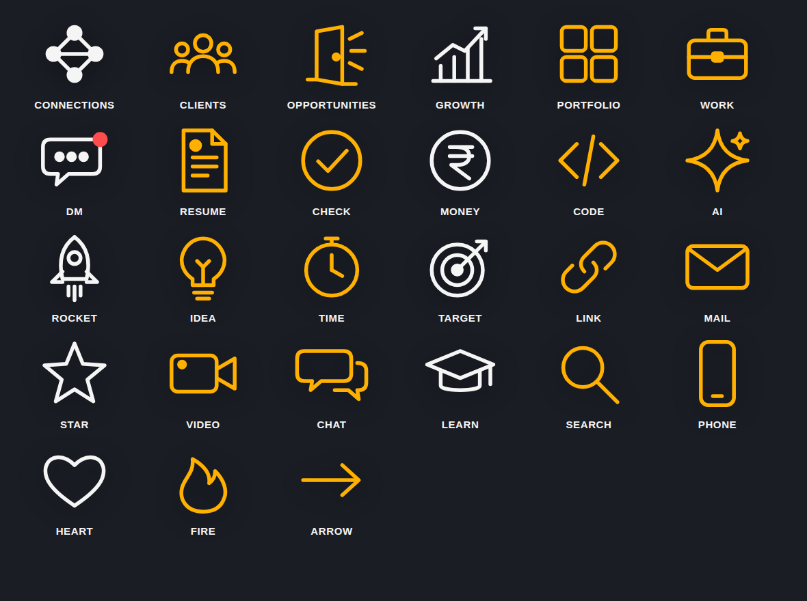

# Animated icons — show the idea, don't just write the word

When the speaker says a **concept** (connections, clients, opportunities, money, AI, growth…), show an **animated icon** that draws itself in on that word — not a text box. Text-only overlays are for numbers, quotes and short phrases.



`icons/icons.js` (in this project folder) is a line-icon library in one consistent style: rounded strokes, 100×100, color = `currentColor`. Each icon **draws in stroke by stroke, then its dots pop one after another**:

- **connections** — network nodes linking up
- **clients** — three people arriving
- **opportunities** — a door opening with light rays

## Setup (once per index.html, after GSAP is loaded)

```html
<script src="icons/icons.js"></script>
```

## Use

```html
<!-- container, positioned like any overlay element -->
<div class="clip" data-start="14.2" data-duration="2.2">
  <div id="ic-connections" style="position:absolute;left:50%;top:420px;transform:translateX(-50%)"></div>
</div>
```

```js
Icons.mount('#ic-connections', 'connections', { size: 230, color: '#FFB000', label: 'CONNECTIONS' });
Icons.in(tl, '#ic-connections', 14.2);   // starts ON the word
Icons.out(tl, '#ic-connections', 16.1);  // optional exit
```

Options for `mount`:

| Option | Default | Notes |
|---|---|---|
| `size` | `200` | Pixels. Use 180–260 at 1080×1920. |
| `color` | `#FFB000` | Use the style's accent color. |
| `label` | none | A small word under the icon. Optional; leave it off when the caption already shows the word. |
| `labelSize` | `size × 0.22` | |
| `labelColor` | `#F5F5F5` | |
| `font` | `Inter, sans-serif` | |
| `weight` | `800` | |
| `glow` | `true` | Set `false` to drop the shadow. |

## Pick the icon from the word

`Icons.forWord('clients')` returns `'clients'`, or `null` if no icon fits. `Icons.list()` returns every name.

| Icon | Words that map to it |
|---|---|
| connections | connection, network, networking, community, LinkedIn |
| clients | client, customers, people, users, audience, team |
| opportunities | opportunity, doors, chance, offers |
| growth | grow, results, revenue, views, followers, scale |
| portfolio | projects, project, website |
| work | job, internship, career, business, agency |
| dm | message, inbox |
| chat | comment, comments, talk |
| resume | cv, document |
| check | real, proof, done, verified |
| money | earn, paid, income, salary, price (₹) |
| code | coding, developer, build, built |
| ai | Claude, ChatGPT, automation, magic |
| rocket | launch, ship, shipped, start, startup |
| idea | ideas, think, tip |
| time | fast, minutes, hours, days |
| target | goal, goals, focus |
| link | bio, url |
| mail | email |
| star | best, premium, quality, skill, skills |
| video | reel, reels, youtube, content |
| learn | learning, college, students, course |
| search | find, discover |
| phone | app, mobile |
| heart | love, like, likes |
| fire | viral, trending, hot |
| arrow | next, follow |

## Rules

- Concept word → icon. Number → count-up. Quote or claim → text. Never all three at once.
- One icon on screen at a time, upper third or beside the head. Never over the face or in the caption zone.
- Hold for 1.2–2.5s, then `Icons.out`. Back-to-back icons can replace each other in the same spot, which reads as a sequence: connections → clients → opportunities.
- Every icon entrance gets a `pop` or `tick` SFX at the same time.
- Need an icon that isn't here? Add it to `ICONS` in `icons.js` in the same style: stroked `class="d"` paths, popping `class="n"` dots, 100×100 grid. Don't paste emoji, clip-art or a different icon style.
